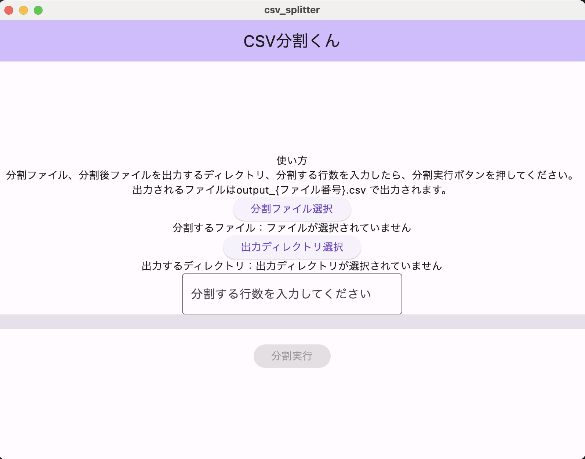
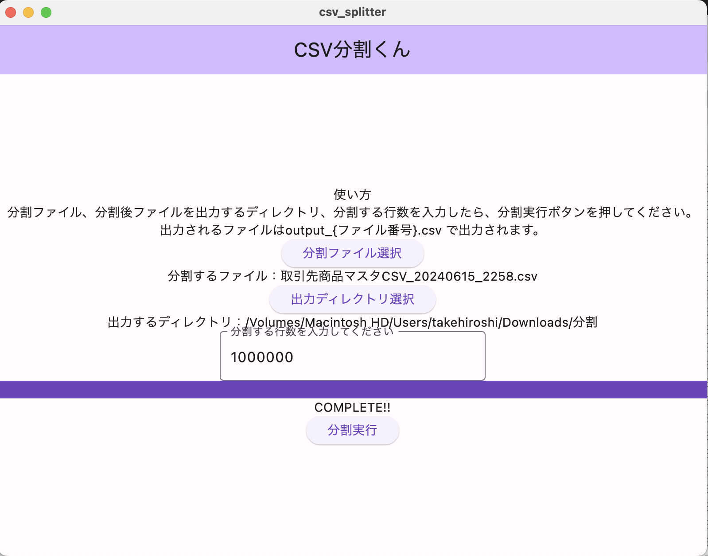

# CSV分割くん

メインのプログラムは lib/main.dart

## 免責
- ◯ぬほどUIがダサいですすみません。
- 文字コードがUTF-8じゃないと分割できない気がします。

## アプリのインストール
Mac向けアプリケーションは release/csv_splitter.zip に置いてあります。解凍してお使いください。
Windows向けは作っていません。（気が向いたら置いておきます）
インストールに際しては「開発元が未確認のMacアプリを開く」を行ってください。

## 特徴
1. CSVの1行目にあるヘッダ行を分割されたファイルたちにも設定します。
2. 分割するファイルの1つあたりの行数を指定して分割します。

## 使い方

1. 分割するCSVファイルを[分割ファイル選択]ボタンで選んでください。
2. 分割後のファイルが作られるディレクトリを[出力ディレクトリ選択]ボタンで選んでください。
3. 分割するCSVの行数を入力欄に入力してください。 10万レコードずつに分割したい場合は、100000と入力してください。
4. 1~3を全て指定したら、[分割実行]ボタンを押してください。メーターが100%になってCOMPLETE!!の表示が出たら完了です。
   2.で指定したディレクトリに output_{n}.csv というファイル名で保存されているのを確認してください。

